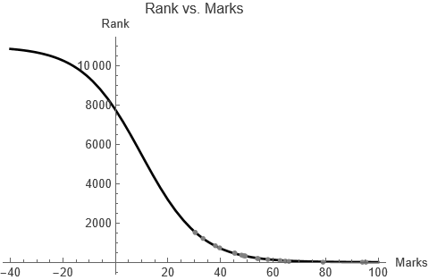

## 1. Introduction

The logistics growth model is defined by the differential equation

[*R*'(*m*) = *r*(1 - *R*(*m*)/*K*)]{.math .display}

with [*R*(0) = *R*~0~]{.math .inline}, where [*K*]{.math .inline} is the
capacity of [*R*(*m*)]{.math .inline}, and [*r*]{.math .inline} is the
rate at which [*R*(*m*)]{.math .inline} changes with respect to
[*m*]{.math .inline}. We are denoting the rank at marks [*m*]{.math
.inline} by [*R*(*m*)]{.math .inline}. Then, the value of [*K*]{.math
.inline} will be [1]{.math .inline} and [*r*]{.math .inline} is to be
estimated. When [*R*(*m*) > 1]{.math .inline}, the rate of change will
be negative. As [*R*(*m*)]{.math .inline} goes to 1, [*R*'(*m*){.math
.inline} will tend to 0. We solve this system along with initial data
[*R*(33.33) = 1212]{.math .inline} (rank-marks pair corresponding to one
of the candidates) using the Mathematica code

```mathematica
DSolve[{R'[m] == R[m](1-R[m]/K), R[33.33] = 1212}, R[m], m]
```

to get

[*R*(*m*) = *e*^-*mr*^(*e*^*mr*^ + 1211*e*^33.33*r*^).]{.math .display}

The overall dynamics then are shown in figure 1, with imaginary value of
[*r*]{.math .inline}.

<figure>

<figcaption>Figure 1: Behaviour of <span
class="math inline"><em>R</em>(<em>m</em>)</span> at <span
class="math inline"><em>r</em> = 0.1</span>.</figcaption>
</figure>

## 2. Simulation

We use the data extracted from 20 actual result score-cards found online
(table 1) to estimate the value of [*r*]{.math .inline} in (1). Using
**NonlinearModelFit** command of Mathematica, we receive
[*r* = 0.0828338]{.math .inline}. Using this value, we plot the correct
graph in figure 2.

  **Marks**   **Rank**   **Marks**   **Rank**
  ----------- ---------- ----------- ----------
  30.33       1521       48.67       336
  33.33       1212       54.33       187
  79          4          54          194
  58          140        62.67       86
  95.33       1          49.33       319
  94          2          30.33       1521
  45.44       467        39.67       734
  48          364        45.33       467
  38          841        49.33       317
  66          44         64.67       57

<figure>

<figcaption>Figure 2: Comparison of the model (black) at <span
class="math inline"><em>r</em> = 0.0828338</span> with actual data
(gray).</figcaption>
</figure>

The model can be used to predict rank of varying marks, as shown in
table 2.

  ---------------------------------------------------------------------------------
  **Marks**   10     20     30     40     50     60     70     80     90     100
  ----------- ------ ------ ------ ------ ------ ------ ------ ------ ------ ------
  **Rank**    8365   3654   1596   697    305    133    59     26     12     5

  ---------------------------------------------------------------------------------

Of course, these are only approximate results, yet fairly accurate.

This article is also available in PDF format at [this
file](../../resources/JAM25_Logistics.pdf).

## References

1.  Barnes, Belinda, and Glenn R. Fulford. *Mathematical Modelling with
    Case Studies: A Differential Equations Approach Using Maple and
    MATLAB.* 2nd ed., CRC Press, 2009.
