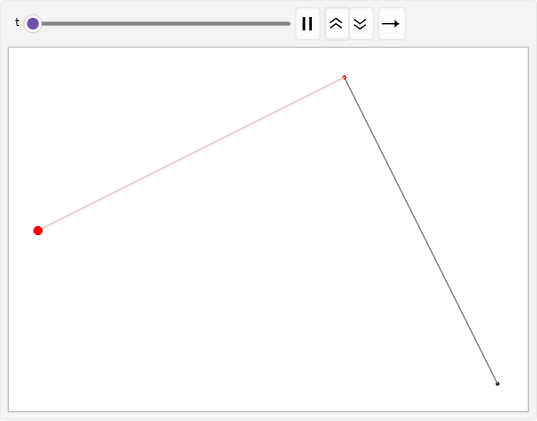
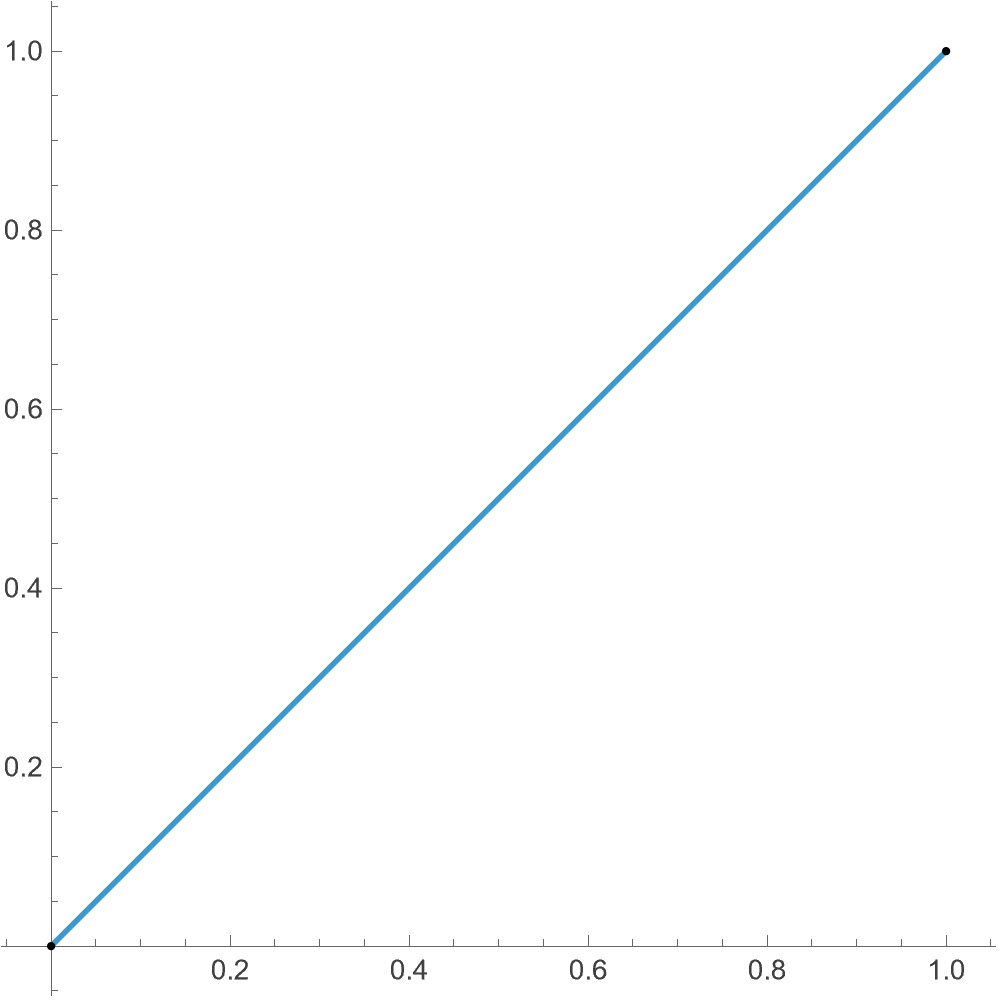
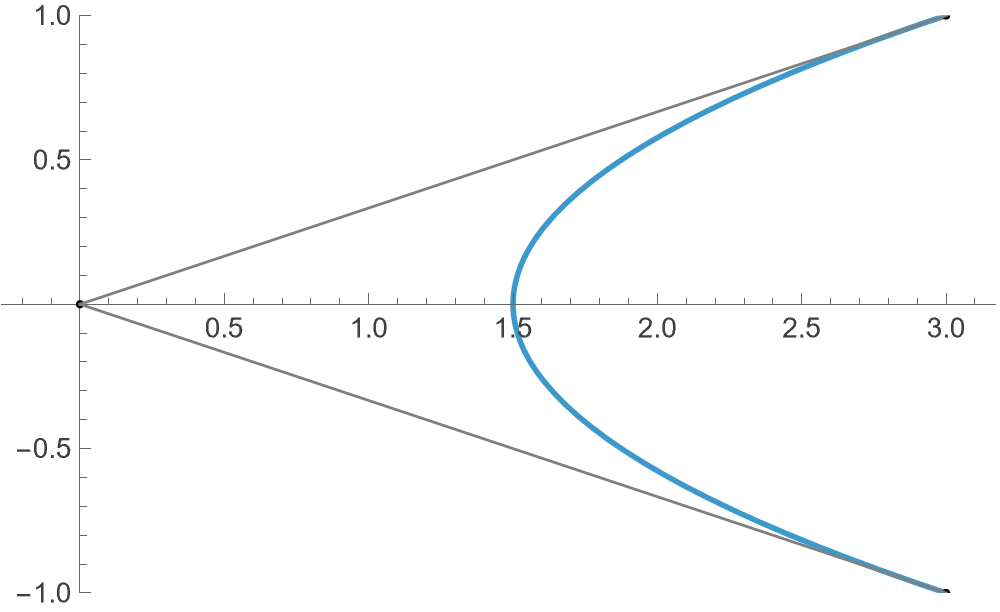
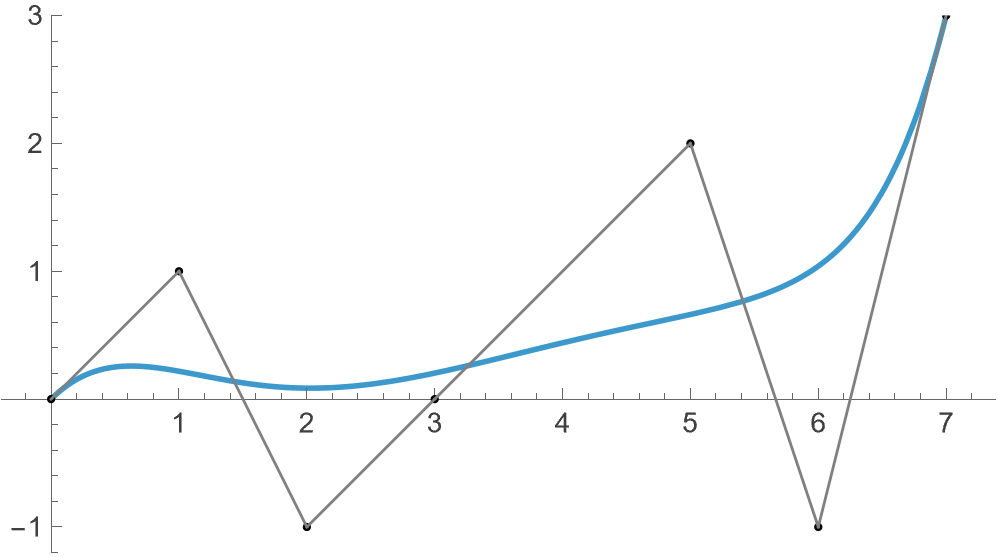
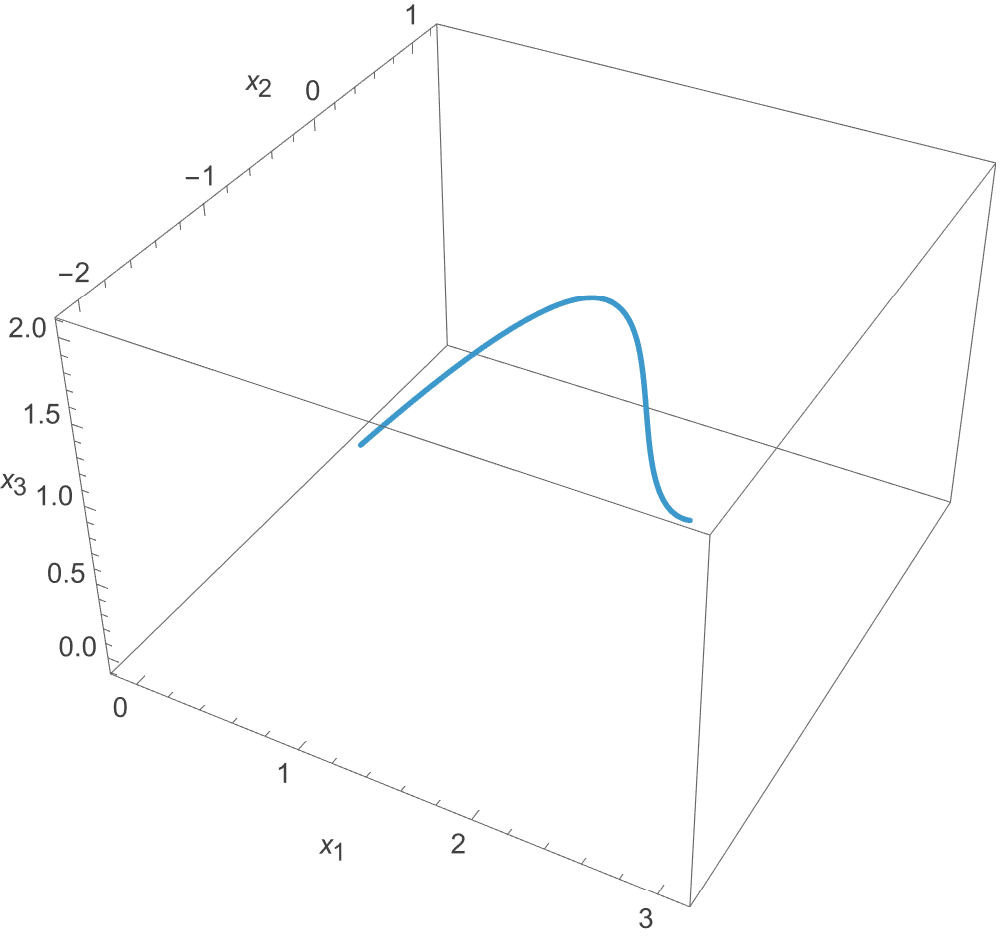

\DeclareMathOperator\Bez{Bez}

Bezier curves are used to model smooth curves of various degrees. A discrete often finite set of points are used to "control" the curve, in the sense that the resulting curve is a smooth approximation of the poligonal path obtained by joining said points end to end. The simplest Bezier curve (linear case) is obtained by using 2 given points $P_0$ and $P_1$. Resultant is merely joining $P_0$ with $P_1$, that is

$$\Bez(P_0,P_1) = (1-t)P_0 + t P_1$$

where $t$ varies from an appropriate range (generally $0\le t\le 1$) to obtain a continuous series of points resulting in a line segment. I am using Mathematica to model this, so we have a basic join function:

```mathematica
join[{P0_, P1_}, t_] := (1-t) P0 + t P1
```

This is a linear curve, as the derivative wrt $t$ is simply

```mathematica
D[join[{P0, P1}, t], t]
(* -P0+P1 *)
```

which is a scalar (free of $t$). The second degree Bezier curve is more interesting. Suppose we have $P_0,P_1,P_2$ three given control points. We first join $P_0$ with $P_1$, and $P_1$ with $P_2$, and then further dynamically join the "corresponding points" on these two paths.



Joining $P_0$ with $P_1$ we obtain

$$P_0 (1-t)+P_1 t$$

and similarly we obtain

$$P_1 (1-t)+P_2 t$$

Note that these two are still points, for each value of $t$. Thus we join them too

```mathematica
join[{join[{P0, P1}, t], join[{P1, P2}, t]}, t] // Simplify
```

to obtain the second degree Bezier curve given by:

$$\Bez(P_0,P_1,P_2)=P_0 (t-1)^2+t \left(P_2 t-2 P_1 (t-1)\right).$$

Differentiating wrt $t$ the first derivative is

$$2 \left(P_0 (t-1)+P_1 (1-2 t)+P_2 t\right)$$

clearly a linear function. The second derivative:

$$2 \left(P_0-2 P_1+P_2\right),$$

a scalar. Furthering one more step, omitting the derivations, the third degree Bezier curve is given by

$$-(-1+t)3 P_0+t (3 (-1+t)2 P_1+t (-3 (-1+t) P_2+t P_3)).$$

In general, the following two functions will calculate the Bezier curve respecting any given control points:

```mathematica
f[t_][batch_] := join[#, t] & /@ Partition[batch, 2, 1]
bezier[pts_List, t_] := Nest[f[t], pts, Length@pts - 1]
```

Now time for some visualisations.

```mathematica
pts = {{0, 0}, {1, 1}};
ParametricPlot[
	bezier[pts,t],
	{t, 0, 1},
	Epilog -> {Point /@ pts, Gray, Line /@ Partition[pts, 2, 1]}
]
```


```mathematica
pts = {{3, 1}, {0, 0}, {3, -1}};
(* same as above *)
```



A more general case:

```mathematica
pts = {{0, 0}, {1, 1}, {2, -1}, {3, 0}, {5, 2}, {6, -1}, {7, 3}};
(* same as above *)
```



Very interestingly, due to the way we have written this setup, merely changing the points to 3D points results in a 3D curve. For example:

```mathematica
pts = {{0, 0, 0}, {1, 1, 1}, {2, -1, 1}, {3, 0, 2}};
(* same as above *)
```



Amazing to see that linear functions and compositions thereof result in the higher dimensional curves.