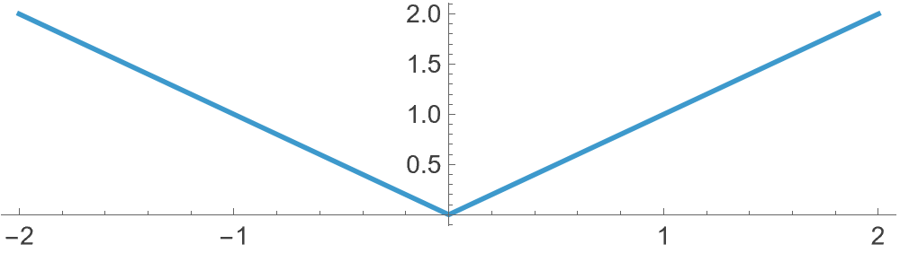
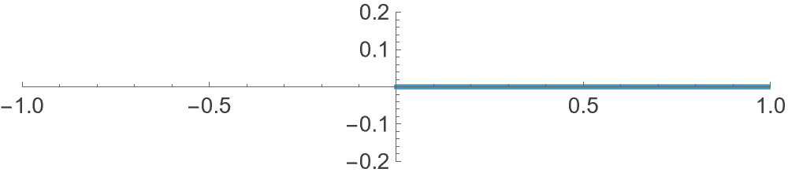
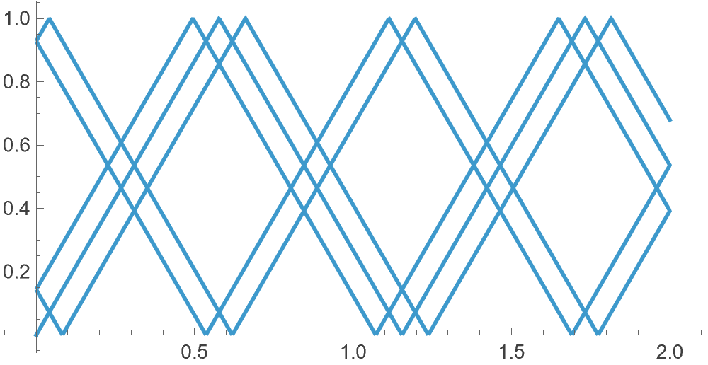

The modulus function $x\mapsto|x|$ does more than just returning the absolute value of a number. When plotted, its graph represents sort of (exactly) a reflection:^[The modulus function $|x|$ gives distance from 0, ignoring direction. Graphically, it folds the negative axis onto the positive.]



This idea can be generalised in order to model the path that a ball of billiards takes in an ideal (infinite force, no friction, etc) environment. Starting with a single dimension, suppose we have an interval of length $L$:

```
0 ------------------------- L
```

To trace reflections along this line, as such:^[Here, each "bounce" is just the same straight motion viewed in a folded interval. In particular, we are not editing the path but the space. The path is still a straight line.]

```
 0 ----------->------------ L
                          |
2L -----------<------------ L
   |
2L ----------->------------ 3L
                          |
        ... --<------------ 3L
```

a simple function such as $f(t,L) = L - |(t \bmod2L) - L|$ can do, so that when $L=1$ we notice

- $0\mapsto 1 - |0-1| = 0$
- $1/2\mapsto 1 - |1/2-1| = 1-1/2 = 1/2$
- $3/2\mapsto 1 - |3/2-1| = 1-1/2 = 1/2$
- $2\mapsto 1- |2-1| = 1-1 = 0$

which is the required behaviour. Now, the only thing that remains is to do the same thing for 2 separate dimensions and combine them. Suppose the starting point on the billiards table is $(x_0,y_0)$ and the movement begins in the direction of angle $\theta$. Let the billiards table be of length $a$ and width $b$. Consider the parametric straight lines

$$x(t) = x_0 + t \cos\theta$$

and

$$y(t) = y_0 + t \sin\theta$$

in the $xy$-plane. We apply $f$ on both of these to obtain $X(t)=f(x(t), a)$ and $Y(t)=f(y(t), b)$. That's it. Now, suppose $(x_0,y_0)=(0,0)$, $\theta=0$ and $t\in[0,20]$, the trajectory is as follows:



Not very exciting! Let us try to change the angle a little:



When $b/a \tan\theta$ is rational, say 1/2, after finite number of reflections the path repeats: we need $\theta$ such that $2\tan\theta=1/2$. $\theta=\tan^{-1}(1/4)$ works:

![$(x_0,y_0)=(0,0)$, $\theta=tan^{-1}(1/4)$, $t\in[0,100]$.](img/bill3.png)

or

![$(x_0,y_0)=(0,0)$, $\theta=tan^{-1}(3/8)$, $t\in[0,100]$.](img/bill4.png)

whereas otherwise, the result is more interesting:

![$(x_0,y_0)=(0,0)$, $\theta=1$, $t\in[0,100]$.](img/bill5.png)

If you liked this, the code is available in this mathematica notebook: [bill.nb](/resources/mm/bill.nb).