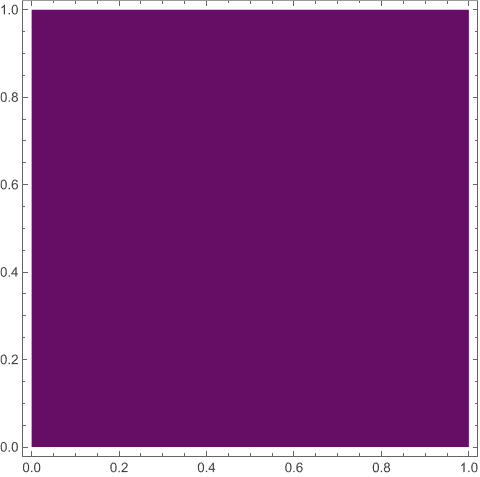
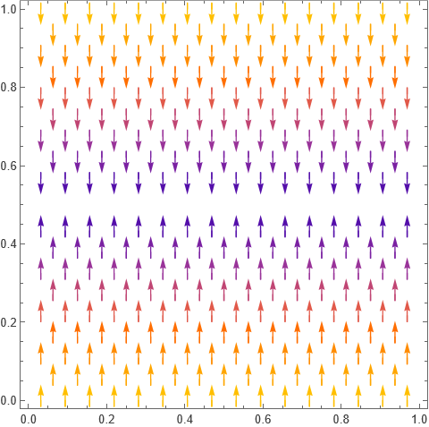
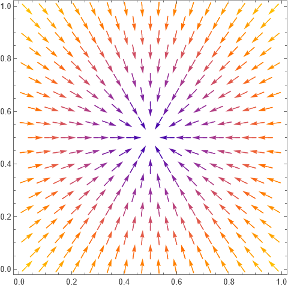
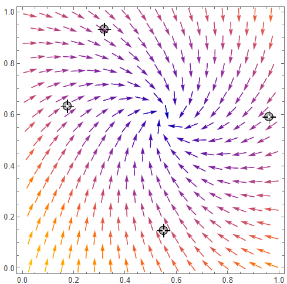

> *It is impossible to comb the hair on a sphere smooth.*
> 
> --- Brouwer


Brouwer's fixed point theorem for the disks is probably one of the most important results in algebraic topology. Loosely speaking, it says that at least one point remains unaffected by any continuous transformation of a closed disk to itself. For one-variable functions, it translates to the following theorem:

**Theorem.** Let $f:[0,1]\to[0,1]$ be any continuous map. Then $f$ has at least one fixed point.

Brouwer's theorem stated formally:

**Theorem.** Any continuous map $f:D^2\to D^2$ has at least one fixed point.

Its applications are divine. Suppose you take a sheet of paper, what are the ways in which this sheet can be mapped to itself?

## Fixed points

In any map, a point $x$ is said to be a fixed point if its image under the map is $x$ itself. For example, consider the identity map $x\mapsto x$. Since each point gets mapped to itself, we say that every point is a fixed point. Consider $x\mapsto x^2$. The image of $0$ is $0^2=0$ so $0$ is a fixed point. On the other hand, $1$ is also a fixed point. But apart from these two, there are no fixed point. $-1\mapsto (-1)^2=1\not=-1$ so $-1$ is not a fixed point. Similarly we can see every other point maps to an image different than itself.

Talking about the sheet of paper example, one way is to take the "image sheet" and put it on top of the "domain sheet" as it is. This is nothing but the identity map, each point gets mapped to itself so that every point is a fixed point. To visualise these examples, I consider this map in Mathematica:

```mathematica
img[ref_][u_,v_] := 
	{(1-u) (1-v), u (1-v), u v, (1-u) v} . ref
```

This takes `ref`: image of 4 endpoints of the rectangle, and returns image of $(u,v)$ under the map sending the points (0,0), (1,0), (1,1), (0,1) to `ref`. For example now,

```mathematica
img[{ {0, 0}, {1, 0}, {1, 1}, {0, 1} }][u,v] // Simplify
(* {u, v} *)
```

hence the map sending reference points to itself, sends all points to themselves. In other words, we visualise this map by assigning to each point a colour based on $f(u,v)-(u,v)$, so that points that are displaced "less" have a different colour than those that are displaced more. This will help us see where exactly the fixed points land. We see the square in terms of these colours to note that:

```mathematica
DensityPlot[Norm[img[{ {0, 0}, {1, 0}, {1, 1}, {0, 1} }][u, v] - {u, v}],
	{u, 0, 1}, {v, 0, 1}]
```



Nothing exciting here. Each point is getting mapped to itself, so the displacement is zero for all of them hence the same purple everywhere. We confirm that all of them are fixed points:

```mathematica
Reduce[img[{ {0, 0}, {1, 0}, {1, 1}, {0, 1} }][u, v] == {u, v}, {u, v}]
(* True *)
```

Now, let us consider a map that flips the square horizontally. That is,

$$(0,0)\longleftrightarrow(0,1),\quad(1,0)\longleftrightarrow(1,1).$$

```mathematica
VectorPlot[img[{ {0, 1}, {1, 1}, {1, 0}, {0, 0} }][u, v] - {u, v},
	{u, 0, 1}, {v, 0, 1}]
```



Evidently, points that are at the line $v=1/2$ do not get affected, and we see a purple strip based on them indicating that their displacement is near 0 (in fact equal to 0). Hence, all points on that line segment are fixed points:

```mathematica
Reduce[img[{ {0, 1}, {1, 1}, {1, 0}, {0, 0} }][u, v] == {u, v}, {u, v}]
(* v == 1/2 *)
```

Now, let us consider

$$(0,0)\longleftrightarrow(1,1),\quad(1,0)\longleftrightarrow(0,1).$$

and the result is:



Now, there is only one fixed point: $(0.5,0.5)$.

## Extension

I extend this exercise to the following:

```mathematica
Manipulate[
	VectorPlot[img[pt][u,v] - {u, v}, {u, 0, 1}, {v, 0, 1},
	  ColorFunction -> GrayLevel],
	{ {pt, { {0, 0}, {1, 0}, {1, 1}, {0, 1} } }, Locator}]
```

which allows freely repositioning the end-points to allow for more detailed transformations. For example:



This shrinks down the square to a quadrilateral determined by the 4 highlighted points. A unique fixed point is apparent.

## More talk

This idea of transforming $D^2$ goes beyond just scaling and translating. For example, as shown below:

](img/paper.png)

if you crumble a piece of paper and place it atop itself, and think of the image of each point in the paper to be wherever it lands in the crumbled form, then again it is a continuous map from $D^2$ to itself. Hence, we can invoke the theorem to say there exists *at least* one point that lands precisely on top of itself, no matter how the paper is crumbled.

The theorem holds for any compact convex subspace of $\mathbb R^n$. For example, it applies to the solid 3-ball $D^3$. A classical illustration is that if you stir a glass of water, there is at least one point in the fluid that ends up exactly where it started.

---

If you enjoyed reading this blog post, I am glad. The code is available at [bfp.nb](/resources/mm/bfp.nb).