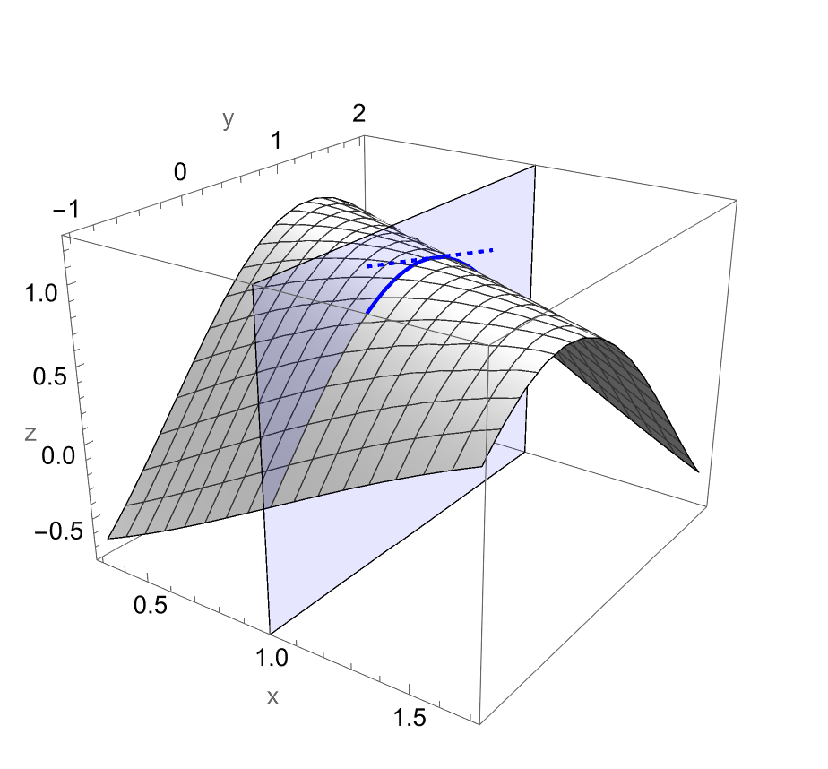
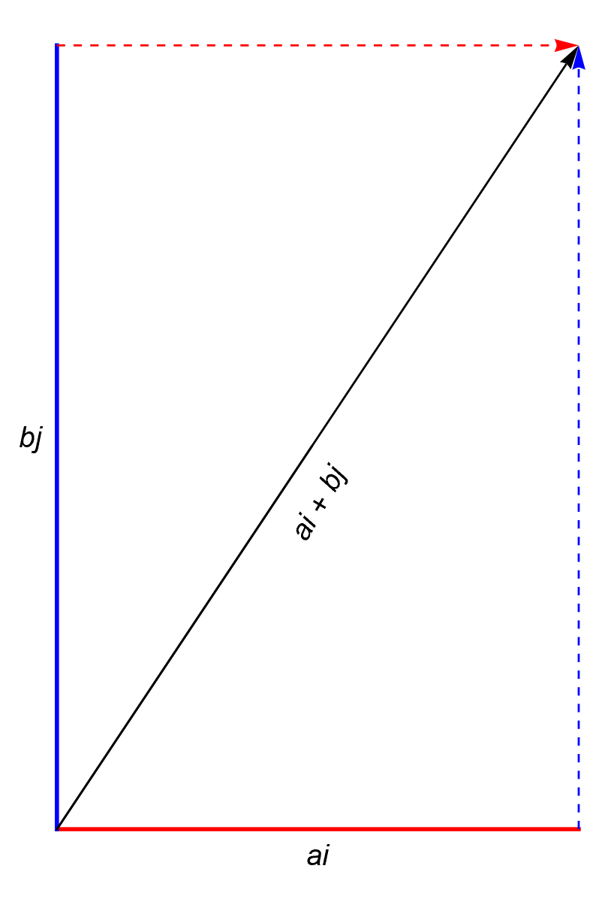

> *Shall we then err in regarding that as the true science of
> Logic which, laying down certain elementary laws, confirmed
> by the very testimony of the mind, permits us thence to deduce,
> by uniform processes, the entire chain of its secondary
> consequences, and furnishes, for its practical applications,
> methods of perfect generality? ...*
> 
> --- Boole

\def\index#1{}
\newcommand\pd[3][]{\frac{\partial^{#1} #2}{\partial #3^{#1}}}
\newcommand\del[1]{\Delta{#1}}
\newcommand\dir[1]{\mathcal D_{\vec{#1}}}
\def\vec#1{#1}

## Preface

This is the second article in the series "Some Notes on Multivariate Calculus," based on the course I studied in 2024 taught by my professor <a href="https://sgtbkhalsadu.ac.in/academics/departments/Mathematics/faculty-detail/97/" target="_blank">Amarpreet ma'am.</a> It is largely due of her consistent encouragement and powerful motivation that these notes could be compiled in the form presented here. To read the first article, visit [this page](functions-of-multiple-variables.html).

## Rates of Change

In a one variable function $f$ of $x$, the derivative\index{derivative} is the rate of change in $f$ with respect to $x$. For two variable functions also, we talk of changes. Unlike one variable functions where the change in $x$ is in certain direction (namely from $x$ to $x+\Delta x$), for two variable functions there can be infinite ways in which the input variables can advance. Two of the most basic ways are along the positive sides of $x$ and $y$ axes. Changes along these are called Partial Derivatives\index{partial derivative}. As the name suggests, partial derivatives only speak about the rates of partial change in the function. That is, the change due to increase in only one of the variables, at a time.

The partial derivative with respect to $x$, denoted by $$\pd fx,$$ will be the change in $f$ when $x$ increases but $y$ remains constant. In figure 1, the curve draw in blue is the intersection of function $f$ and the plane $x=1$. This is called the trace of $y$ in the concerned plane. At any point $(1, y_0)$ on this curve, the slope of the tangent to it (which can be found now as this is just a function of $y$ alone, $x$ being constant at $1$) will be the partial derivative of $f$ with respect to $y$ at $(1, y_0)$.

Mathematically, we define the partials as
$$\begin{aligned}
	\pd fx &= \lim_{\del x \to 0} \frac{f(x + \del x, y_0) - f(x, y_0)}{\del x}, \\
	\pd fy &= \lim_{\del y \to 0} \frac{f(x_0, y + \del y) - f(x_0, y)}{\del y}.
\end{aligned}$$

Similar definitions can be written for double partial derivatives, or mixed partials as well. For example, the mixed partial
$$\frac{\partial}{\partial y}\pd zx$$
can be calculated by considering $$\pd zx$$ as a function and partially differentiating it with respect to $y$:
$$
	\frac{\partial^2z}{\partial y\partial x}=
	\lim_{\del y \to 0} \frac{f_x(x_0, y + \del y) - f_x(x_0, y)}{\del y}
$$

Based on that, we present a question on partials: find slope of the line parallel to the $xz$-plane and tangent to the surface $$z=x\sqrt{x+y}$$ at the point $P(1, 3, 2)$. Such line being parallel to the $xz$-plane will run through a constant $y$ value, therefore we have to evaluate $f_x(1,3)$. This can be done using the definition given above, as follows:---

\begin{aligned}
	f_x(1, 3) &= \lim_{\del x \to 0} \frac{f(1 + \del x, 3) - f(1, 3)}{\del x} \\
			 &= \lim_{\del x \to 0} \frac{(1 + \del x)\sqrt{1 + \del x + 3} - \sqrt{1 + 3}}{\del x} \\
			 &= \lim_{\del x \to 0} (1 + \del x)\frac12(4 + \del x)^{-\frac12} + \sqrt{4 + \del x} \\
			 &= 1\left(\frac12\right)(4)^{-\frac12}+2 \\
			 &= 2\frac14.
\end{aligned}

On mixed partials, we mention an important theorem below.

**Theorem** *(Equality of Mixed Partials).*
Mixed partials ${\partial^2 f}/({\partial x \partial y})$ and ${\partial^2 f}/({\partial x \partial y})$ of the function $f(x,y)$, if they exist, satisfy
$$f_x(x_0,y_0) = f_y(x_0,y_0)$$
if both are continuous in an open disk\index{open disk} containing $(x_0, y_0)$.

In other words, this theorem states that for such functions, the order of differentiation does not matter while computing mixed partials. Consider the given function
$$f(x, y) = \begin{cases}
	xy\left(\frac{x^2-y^2}{x^2+y^2}\right), & (x,y)\not=(0,0), \\
	0, & (x,y)=(0,0).
\end{cases}$$
We show that

- $f_x(0,y) = -y$
- $f_y(x,0) = x$
- $f_{xy}(0,0) = -1$
- $f_{yx}(0,0) = 1$

For the first part:

$$\begin{aligned}
	f_x(0, y)	 &= \lim_{\Delta x \to 0} \frac{f(\Delta x,y) - f(0, y)}{\Delta x} \\
	         	 &= \lim_{\Delta x \to 0} \frac{y \Delta x \frac{\big((\Delta x)^2 - y^2\big)}{\big((\Delta x)^2 + y^2\big)}}{\Delta x} \\
    			 &= -y.
\end{aligned}$$

Similarly, the other parts can be solved. It is worth noting that the mixed partials\index{mixed partials} in this case will not be equal to each other. However, this does not violate the theorem on mixed partials equality since the function in question is not continuous.

## Directional Derivatives

A broader type of derivatives are the directional derivatives, which are calculated for a function in a given direction. In this sense, $$\pd fx$$ is the derivative of $f$ along the vector $1\hat i + 0 \hat j$. In extension to that, directional derivative along the vector $\vec v=a\hat i + b \hat j$ would be the rate of change in $f$ in the direction of this vector. It is denoted by $\dir vf$. In figure \ref{dirderiv_visualised}, the plane goes in the direction of $\vec v$, and the red coloured curve is its intersection with $f$. Then, $\dir vf$ is slope of the tangent on this curve at the concerned point.

---

This is the second article in the series "Some Notes on Multivariate Calculus." If you enjoyed reading it, I am glad. For any feedback or discussion, please contact me via email at namtgr at gmail dot com. The graphs for this article were created using Mathematica. A notebook containing them can be found at [this link](../../resources/mm/dmc.nb).
