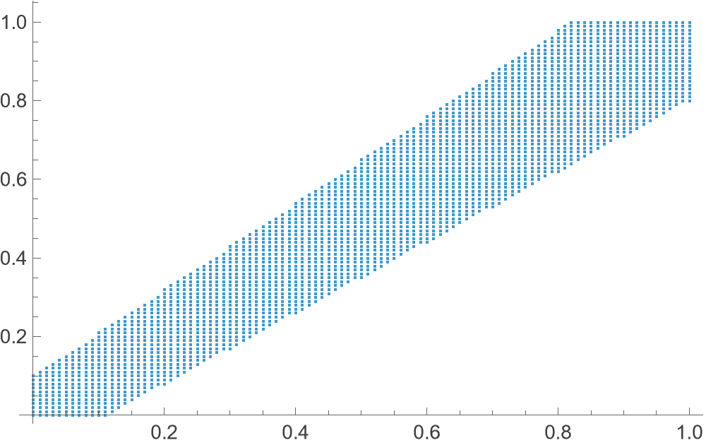
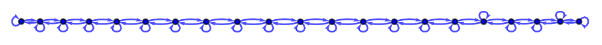
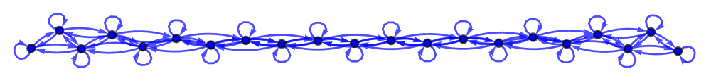
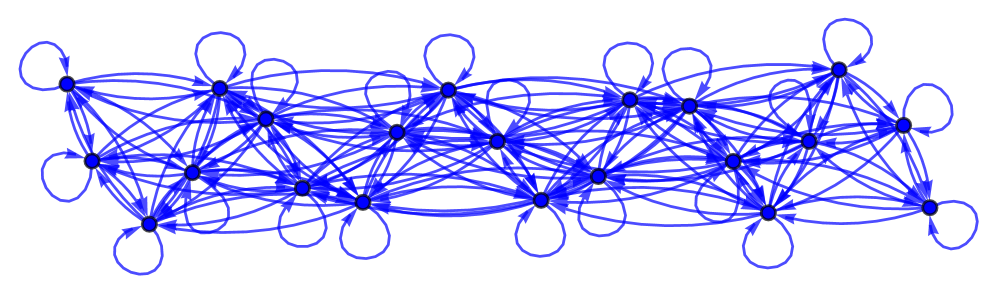
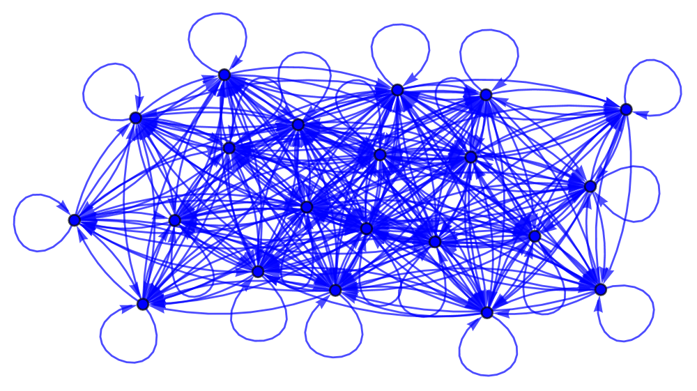
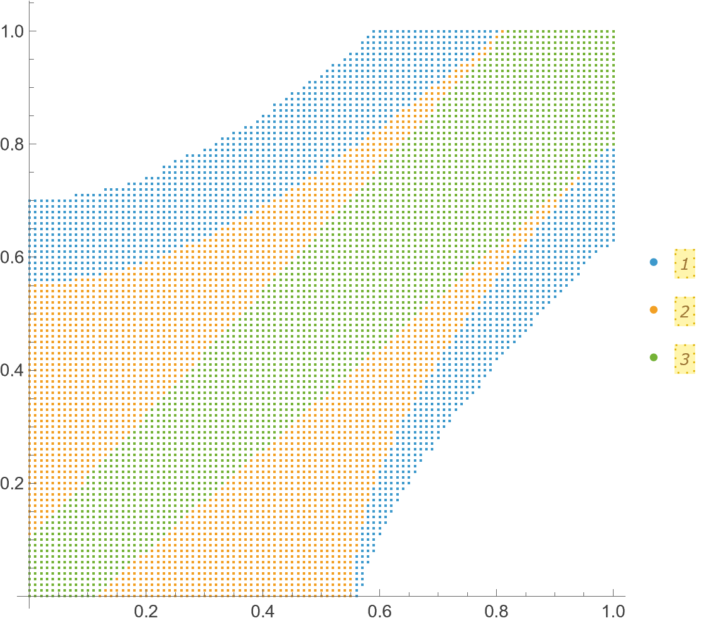

In real calculus, a sequence of points is said to be Cauchy if at arbitrarily large indices, points start getting arbitrarily close to each other. This sounds like the very definition of convergence, and in fact on $\mathbb R$, convergence and Cauchy-ness of sequences go hand in hand. But, suppose we talk about the sequence $a_n = 1/n$ for $n\ge2$ on the interval $(0,1)$. It is still Cauchy, but it is not convergent, for the limit ($=0$) does not belong to the interval (our space). Topologically, we can say a sequence $x_n$ is convergent to the limit $x$ if every nbhd $U$ of $x$ contains all but finitely many points of the sequence. But, to define Cauchy sequences, a notion of distance is required. Enter: entourages.

On a set $X$, an entourage (upto my understanding, I have just begun business with this) is just a subset of the product $X\times X$ with the condition that it contains the diagonal $\delta = \{(x,x): x\in X\}$.



With entourages, we now have a notion of distance. In particular, we call $x$ and $y$ to be $U$-"close" to each other if the point $(x,y)$ belongs to the entourage $U$.^[Now, we can call a sequence $x_n$ to be $U$-Cauchy if there exists some $N\in \mathbb N$ such that $(x_m,x_n)$ belongs to $U$ for each $m,n\ge N$. That is all I have to share.] Below I present some graphs in Mathematica.

Some entourage-defining functions:

```mathematica
d[1, a_][{x_, y_}] := Abs[x - y] <= a
d[2, a_:1][{x_, y_}] := Abs[x-y] <= a (1 + Abs[x])
d[3, a_:1, s_:1][{x_, y_}] := Abs[(1 + s x) (x - y)] <= a
d[4, a_:1, f_][{x_, y_}] := Abs[f[x] - f[y]] <= a
```

Then, to define an entourage, one could do:

```mathematica
x = Range[0, 1, 0.01];
x2 = Tuples[X, 2];
u = Select[X2, d[2, 0.01]];
```

and present it using

```mathematica
ListPlot[u]
```

which returns the figure shown above. One could also draw a directed graph of points of $x$ with a directed edge between two points indicating closeness among them. For example, with $x=\{0, 0.05, 0.1,\ldots, 1\}$, below we have the entourage defined by `d[1, a]` for varying $a$.









With each increase in the value of $a$, we have thereby "relaxed" the definition of points being "close" to each other and hence more points are connected to each other.

Finally, in the following figure, red is by `d[2,0.1]`, green by `d[4,0.15,Cos]` and blue is the "composition" of both of these.



Thanks.