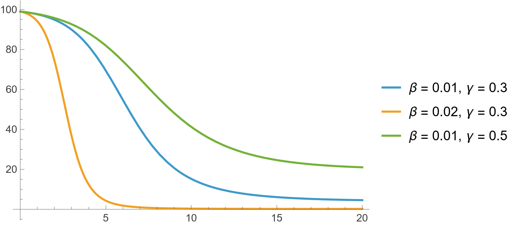
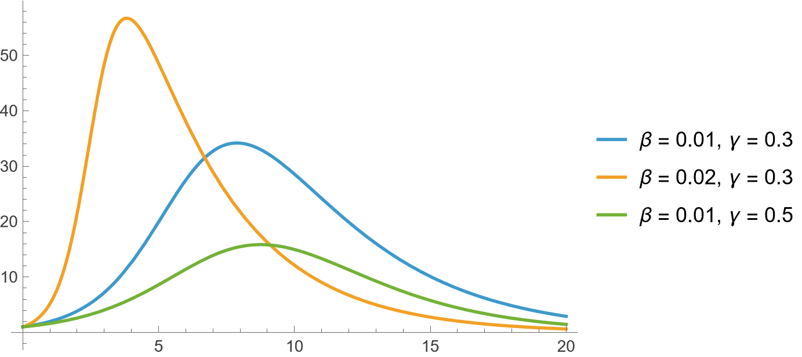
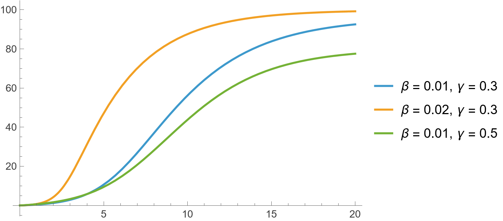
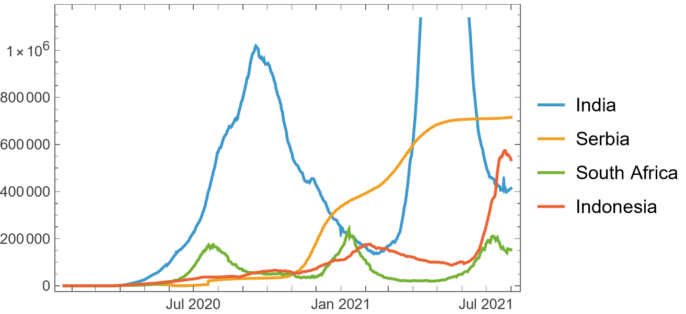

In [Population Growth](/pages/posts/population-growth.html) I introduced a simple model for how populations evolve over time. But real-world systems are rarely that simple. In this post, I shift focus to epidemiology, where we model how diseases spread using the SIR framework and a very natural extension of it.

## SIR model

SIR model governs the spread of disease in a population containing $N$ people. Categorise everyone into three groups: susceptible (S), infectives (I), and recovered (R). The flow is as follows:

```
-----      ß     -----      a     -----
| S |  --------> | I |  --------> | R |
-----            -----            -----
```

that is, people move from S into I at a rate of $\beta$, and from I into R at a rate of $\gamma$. These are called the rates of infection and recovery, respectively. In differential equations, we write

$$S'=-\beta SI,\qquad I'=\beta SI-\alpha I,\qquad R'=\alpha I.$$

$\beta$ and $\alpha$ are usually predicted using data. The total population $N$ is assumed to be constant, that is $N=S+I+R$ at all points in time. A central parameter is the reproduction number which captures the balance between infection and recovery. For SIR model we have $R_0=\beta/\gamma$. If $\beta>\gamma$, the infection rises and if $\gamma<\beta$, it dies out. Solve and plot the system of equations to get:





For any value of $\beta$ and $\gamma$, the dynamics look monotonous. Infection rises upto a point, and then starts decreasing to eventually vanish. However, in real life that is not always the case. We show some examples of actual infection trajectories in some countries below:



Various models exist in the literature regarding disease spread, but one from an exploratory point of view that has caught my attention is [[1](https://doi.org/10.1371/journal.pone.0265815)]. They incorporate several new additions to the system of equations discussed above, and their model is as follows:

$$\begin{aligned}
\frac{dS}{dt} &= -\beta S(t) I(t) + f(t), \\
\frac{dI}{dt} &= \beta S(t) I(t) - \gamma I(t) + g(t), \\
\frac{dR}{dt} &= \gamma I(t) + h(t).
\end{aligned}$$

where $f(t)$ is people moving in/out without infection, $g(t)$ is infections coming from outside, $g(t)$ is recovered returning from outside. To avoid over-fitting, the functions $f,g,h$ are given the following forms:

$$\begin{aligned}
f(t) &= \lambda_1 t + \lambda_2, \\
g(t) &= a_1 b_1 \cos(b_1 t + c_1)
     + a_2 b_2 \cos(b_2 t + c_2)
     + a_3 b_3 \cos(b_3 t + c_3), \\
h(t) &= p_1 t + p_2.
\end{aligned}$$

## References

[1] AlQadi H, Bani-Yaghoub M (2022) Incorporating global dynamics to improve the accuracy of disease models: Example of a COVID-19 SIR model. PLOS ONE 17(4): e0265815. doi: [10.1371/journal.pone.0265815](https://doi.org/10.1371/journal.pone.0265815)