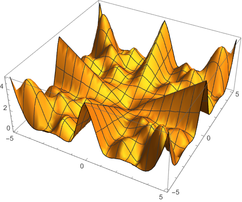
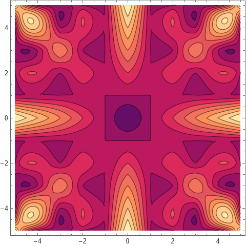
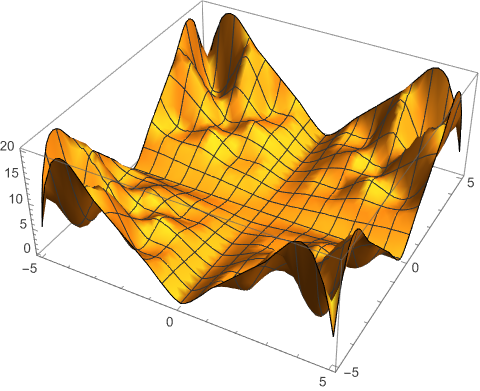
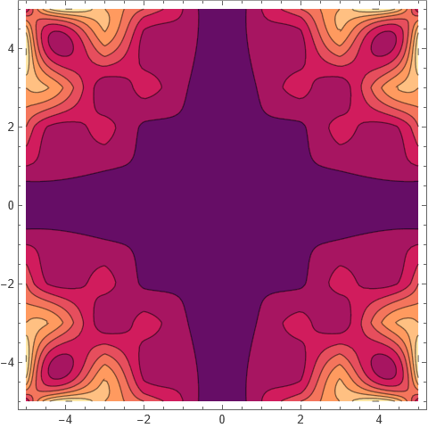
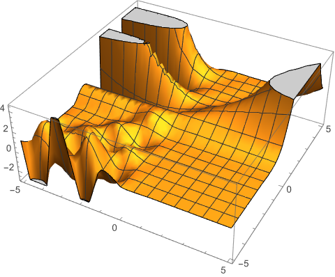
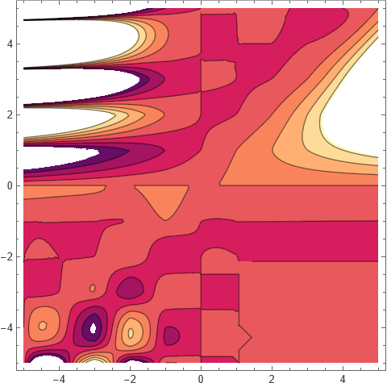
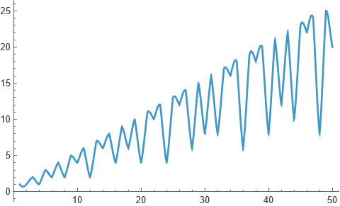

**Interpolation** is a fundamental technique in mathematics and data analysis used to estimate values between known data points. Interpolation constructs a function that passes through (or closely approximates) given data points, allowing predictions at intermediate values. There are many methods of interpolation, from simple linear approaches to higher-order polynomials and splines, each balancing accuracy and smoothness. Mathematica has an in-built command `Interpolation` which does the job. In the help section of this command is an example showing how GCD function can also be interpolated; extended to real values too. I share that in this blog.

For GCD function:&mdash;

---

Similarly the LCM function:&mdash;

---

Binomial(*n*, *k*) function returns the binomial coefficient
$$\binom{n}{k} = \frac{n!}{k!(n-k)!}$$

---

Finally a one variable function: euler phi function.

