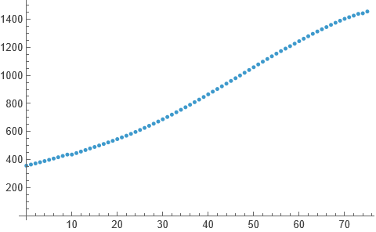
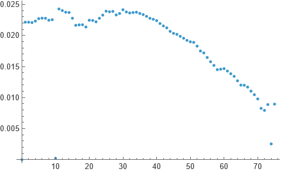
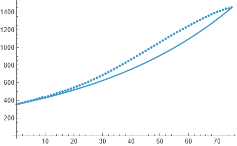
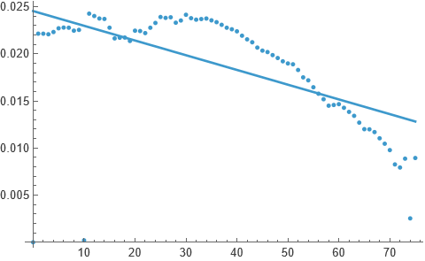
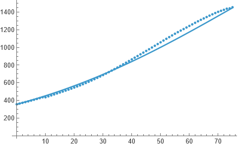
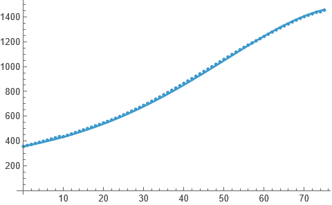

Population growth models are one of the most basic mathematical models and are often used to introduce the subject of modelling to newcomers. In this post I will present an introductory discussion on these models using real life dataset. I consider the Indian population during 1950&ndash;2025. I will be using Mathematica. First off, I show the data:

```mathematica
india = TimeSeries@N@Transpose[{{1, 0}, {0, 10^-6}} .
	Transpose[Import[NotebookDirectory[] <> "../data/ipop.csv", "CSV"]] - {1950, 0}]
	(* scaling and translating the data *);
p0 = india[0];
ListPlot[india]
```


We will start with an exponential growth model: $p'(t)=rp(t), p(t_0)=p_0$. $r$ here is the constant growth rate, which we can take to be the average of yearly growth of the population.

```mathematica
gr = TimeSeries[Transpose[{
	india["Times"],
	{0} ~ Join ~ (Differences[india["Values"]]/india["Values"][[;;-2]])}]];
ListPlot[gr]
```


Average of these values comes out to be 0.018672 and so we set $r$ to be that. Solving the above differential equation we get $p(t)=357.021 e^{0.018672t}$, which is then compared with the data below:

```mathematica
r[1] = gr["Values"] // Mean // N;
s[1][t_] = DSolveValue[{p'[t] == r[1] p[t], p[0] == p0}, p[t], t];
Show[
	ListPlot[india],
	Plot[s[1][t], {t, 0, 75}]]
```


This is good but not the best we'll be having today. Notice that $r$ here is supposed to be constant, whereas that is not the case in general. The growth rates shown above were not constant, hence we can try to fit a time dependent function to the growth rate data:

```mathematica
r[2]= NonlinearModelFit[gr["Path"], a0 + a1t, {a0, a1}, t];
Show[
	ListPlot[gr],
	Plot[r[2][t], {t, 0, 75}]]
```


Now we can use this linear function in $r(t)$ in lieu of the constant $r$ used above:

```mathematica
s[2][t_] = DSolveValue[{p'[t] == r[2] [t] p[t], p[0] == p0}, p[t], t];
Show[
	ListPlot[india],
	Plot[s[2][t], {t, 0, 75}]]
```


This is clearly far better than the previous fit! However, notice that the growth rate does not really look like a linear curve rather a quadratic curve. And therefore:

```mathematica
r[3] = NonlinearModelFit[gr["Path"], a0 + a1 t + a2 t^2, {a0, a1, a2}, t];
s[3][t_] = DSolveValue[{p'[t] == r[3][t] p[t], p[0] == p0}, p[t], t];
Show[
	ListPlot[india],
	Plot[s[3][t], {t, 0, 75}]]
```


Amazing! In the next post, I will be continuing this and discussing the logistics growth model using all three growth rates: constant, linear, and quadratic.