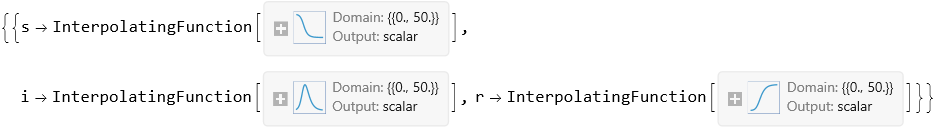
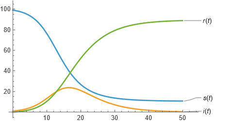
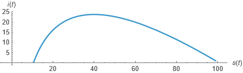

```wl
In[]:= equations := {s'[t] == -\[Beta] s[t] i[t], i'[t] == \[Beta] s[t] i[t] - \[Gamma] i[t], r'[t] == \[Gamma] i[t]}
 ic := {s[0] == 99., i[0] == 1., r[0] == 0.}
 parameters := {\[Beta] -> .005, \[Gamma] -> .2}
```

```wl
In[]:= sol = NDSolve[{equations /. parameters, ic}, {s, i, r}, {t, 0, 50}]
```



```wl
In[]:= Plot[
   Evaluate[{s[t], i[t], r[t]} /. sol], 
   {t, 0, 50}, 
   PlotLabels -> {s[t], i[t], r[t]}, 
   PlotRange -> All 
  ]
```



```wl
In[]:= ParametricPlot[
   Evaluate[{s[t], i[t]} /. sol], 
   {t, 0, 50}, 
   AxesLabel -> {s[t], i[t]} 
  ]
```



```wl
In[]:= Reduce[Last /@ equations == 0, {s[t], i[t], r[t]}]
```

```wl
Out[]= (\[Gamma] == 0 && \[Beta] == 0) || (\[Gamma] == 0 &&s[t] == 0) || i[t] == 0
```

```wl
In[]:= D[Last /@ equations, {{s[t], i[t], r[t]}}] /. {i[t] -> 0, r[t] -> 0, s[t] -> 1}
```

```wl
Out[]= {{0, -\[Beta], 0}, {0, \[Beta] - \[Gamma], 0}, {0, \[Gamma], 0}}
```

```wl
In[]:= Eigenvalues[% /. parameters]
```

```wl
Out[]= {-0.195, 0., 0.}
```

```wl
In[]:= FindMaximum[Evaluate[i[t] /. sol], {t, 0, 50}]
```

```wl
Out[]= {23.7504, {t -> 16.5091}}
```

```wl
In[]:= Evaluate[r[50] /. sol]
```

```wl
Out[]= {88.8458}
```

```wl
In[]:= Manipulate[
   sol = NDSolve[{equations /. {\[Beta] -> b, \[Gamma] -> 0.1}, ic}, {s, i, r}, {t, 0, 50}]; 
   Plot[Evaluate[i[t] /. sol], {t, 0, 50}, PlotRange -> All], 
   {b, 0.0005, 0.005} 
  ]
```

MarkdownTools`Private`ExportAnimatedImage[AnimatedImage[-Video-], {GeneratedAssetLocation -> D:\11\website\resources\mm\img\, WolframLanguageTag -> wl}]